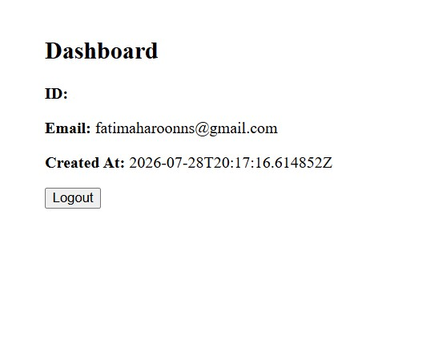

# Authentication Frontend

A React frontend for a complete authentication system. It allows users to create an account, log in, access protected pages using JWT authentication, and log out securely.

## Features

- User Signup
- User Login
- Client-side Form Validation
- JWT Token Storage
- Protected Routes
- Dashboard
- Logout Functionality

## Technologies Used

- React
- React Router DOM
- Axios

## Installation

Clone the repository:

```bash
git clone https://github.com/FatimaH2912/Authentication-Flow
cd authentication-frontend
```

Install dependencies:

```bash
npm install
```

Start the application:

```bash
npm start
```

The application will run on:

```
http://localhost:3001
```

## Backend Requirement

This project requires the Authentication Backend API to be running on:

```
http://localhost:3000
```

## Project Structure

```
src/
│
├── components/
│   └── InputField.js
│
├── pages/
│   ├── Signup.js
│   ├── Login.js
│   └── Dashboard.js
│
├── routes/
│   └── ProtectedRoute.js
│
├── services/
│   └── api.js
│
├── utils/
│
├── App.js
└── index.js
```

## Authentication Flow

1. User signs up.
2. User logs in.
3. JWT token is stored in localStorage.
4. Protected routes require authentication.
5. JWT is sent with authenticated requests.
6. User logs out and the token is removed.

## Screenshots

### Signup Page


### Login Page


### Dashboard



## Author

Fatima Haroon